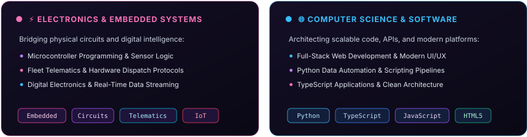

<!-- ==================== HERO SHOWCASE BANNER ==================== -->
<div align="center">
  
</div>

<br/>

<!-- ==================== TELEMETRY HUD BAR ==================== -->
<div align="center">
  
  &nbsp;
  
  &nbsp;
  <a href="https://github.com/Nixxzzzzz?tab=repositories" target="_blank">
    
  </a>
  &nbsp;
  
  &nbsp;
  
</div>

<br/>

<!-- ==================== ANIMATED LASER DIVIDER ==================== -->
<div align="center">
  
</div>

<br/>

<!-- ==================== WHOAMI TERMINAL WORKSTATION ==================== -->
<div align="center">
  
</div>

<br/>

<!-- ==================== ANIMATED LASER DIVIDER ==================== -->
<div align="center">
  
</div>

<br/>

<!-- ==================== HARDWARE & SOFTWARE DUAL PILLARS ==================== -->
<div align="center">
  
</div>

<br/>

<!-- ==================== INTERACTIVE SYSTEM & FLEET SHOWCASE ==================== -->
### `// 01. INTERACTIVE SYSTEMS & PROJECT MATRIX`

<div align="center">
  
</div>

<br/>

<!-- ==================== TECHNICAL ARSENAL ==================== -->
### `// 02. TECHNICAL ARSENAL & SYSTEM STACK`

<div align="center">

| Domain | Technologies, Frameworks &amp; Protocols |
| :--- | :--- |
| **Languages** | `Python` • `TypeScript` • `JavaScript` • `C/C++` • `HTML5` • `CSS3` • `SQL` |
| **Electronics &amp; Hardware** | `Microcontrollers` • `Arduino` • `ESP32` • `Circuit Design` • `IoT Sensors` • `Fleet Telematics` |
| **Web &amp; Cloud Architecture** | `React` • `Node.js` • `Express` • `REST APIs` • `Tailwind CSS` • `Bootstrap` |
| **Developer Ecosystem** | `Git` • `GitHub` • `VS Code` • `Linux` • `Bash` |

<br/>


</div>

<br/>

<!-- ==================== GITHUB TELEMETRY & ACTIVITY ==================== -->
### `// 03. GITHUB ACTIVITY & TELEMETRY`

<div align="center">

<a href="https://github.com/Nixxzzzzz" target="_blank">
  
</a>
&nbsp;
<a href="https://github.com/Nixxzzzzz" target="_blank">
  
</a>

<br/><br/>


</div>

<br/>

<!-- ==================== ENGINEERING JOURNEY ==================== -->
### `// 04. ENGINEERING JOURNEY & PASSION`

<div align="center">

> *"As a college student pursuing both electronics and computer science, I am on a journey to unravel the wonders of technology."*

</div>

I am deeply fascinated by the boundary where **physical hardware circuits meet intelligent software**. Whether it’s writing firmware for microcontrollers, streaming real-time telematics coordinates, or engineering responsive digital platforms, I love transforming technical curiosity into working systems.

- 🔭 **Current Focus:** Telematics dispatch platforms, IoT device communication, and full-stack web applications.
- 🌱 **Continuous Learning:** Embedded systems architecture, advanced TypeScript, and cloud-connected hardware.
- 💡 **Aspiration:** Bridging the gap between physical silicon and elegant digital software.

<br/>

<!-- ==================== CONNECT & DISPATCH ==================== -->
### `// 05. CONNECT & COLLABORATE`

<div align="center">

<a href="https://github.com/Nixxzzzzz" target="_blank">
  
</a>
&nbsp;
<a href="https://github.com/Nixxzzzzz?tab=repositories" target="_blank">
  
</a>

</div>

<br/>

<!-- ==================== ANIMATED LASER DIVIDER ==================== -->
<div align="center">
  
</div>

<br/>

<!-- ==================== ANIMATED MANIFESTO QUOTE ==================== -->
<div align="center">
  
</div>

<br/>

<!-- ==================== MINIMALIST CYBER FOOTER ==================== -->
<div align="center">

```text
[ STATUS: SYSTEM NOMINAL // 7 REPOSITORIES ACTIVE // OPEN FOR EMBEDDED & FULL-STACK INITIATIVES ✨ ]
```

<sub>© Sonia (@Nixxzzzzz) · Electronics &amp; Computer Science Engineer</sub>

</div>
