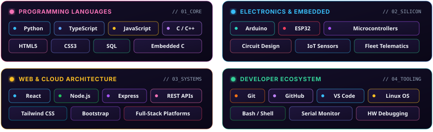
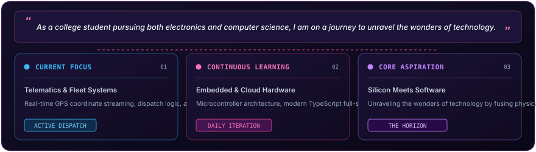

<!-- ==================== HERO SHOWCASE BANNER ==================== -->

  

 

<!-- ==================== TELEMETRY HUD BAR ==================== -->

  
  &nbsp;
  
  &nbsp;
  
  &nbsp;
  
  &nbsp;
  

 

<!-- ==================== ANIMATED LASER DIVIDER ==================== -->

  

 

<!-- ==================== WHOAMI TERMINAL WORKSTATION ==================== -->

  

 

<!-- ==================== ANIMATED LASER DIVIDER ==================== -->

  

 

<!-- ==================== HARDWARE & SOFTWARE DUAL PILLARS ==================== -->

  

 

<!-- ==================== INTERACTIVE SYSTEM & FLEET SHOWCASE ==================== -->
### `// 01. INTERACTIVE SYSTEMS & PROJECT MATRIX`

  

 

<!-- ==================== TECHNICAL ARSENAL ==================== -->
### `// 02. TECHNICAL ARSENAL & SYSTEM STACK`

  

    

  

 

<!-- ==================== GITHUB TELEMETRY & ACTIVITY ==================== -->
### `// 03. GITHUB ACTIVITY & TELEMETRY`

&nbsp;

  

 

<!-- ==================== ENGINEERING JOURNEY ==================== -->
### `// 04. ENGINEERING JOURNEY & PASSION`

  

 

<!-- ==================== CONNECT & COLLABORATE ==================== -->
### `// 05. CONNECT & COLLABORATE`

&nbsp;

&nbsp;

 

<!-- ==================== ANIMATED LASER DIVIDER ==================== -->

  

 

<!-- ==================== ANIMATED MANIFESTO QUOTE ==================== -->

  

 

<!-- ==================== FOOTER TELEMETRY ==================== -->

  <code>[ STATUS : ONLINE 24/7 ] ✦ [ CORE DISCIPLINE : ECE✕CSE ] ✦ [ EMBEDDED CIRCUITS &amp; CLOUD SOFTWARE INTELLIGENCE ]</code>

